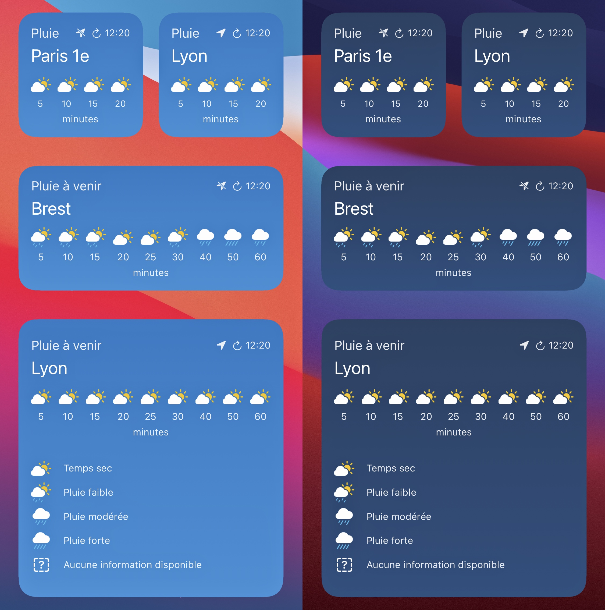

# 🌧️ Rain Forecast Widget

## Sommaire

- [À propos](#à-propos)  
- [Liste des besoins](#liste-des-besoins)  
- [Fonctionnalités](#fonctionnalités)  
- [Alertes](#alertes)  
- [Tableau](#tableau)  
- [Technologies utilisée](#technologies-utilisée)  
- [Prérequis](#prérequis)  
- [Installation](#installation)  
- [Commandes utiles](#commandes-utiles)  
- [Tests](#tests)  
- [Roadmap](#roadmap)  
- [Contact](#contact)  

---

## À propos

Ce projet propose un widget personnalisable de prévisions de pluie sur 1h, basé sur les données de Météo-France.  
Il a pour objectif principal d’afficher de manière simple, claire et responsive les prévisions à très court terme.

Il répond aux besoins suivants :  

- Visualisation rapide de la pluie dans l’heure.
- Personnalisation facile à intégrer dans n’importe quel site.
- Support léger et sans dépendances lourdes.


<div>
  
</div>

---

## Liste des besoins

- Besoin 1 : Intégration simple sur n'importe quel site.
- Besoin 2 : Données officielles issues de Météo-France.
- Besoin 3 : Affichage responsive et esthétique.

---

## Fonctionnalités

| Fonctionnalité                          | Statut |
|----------------------------------------|--------|
| Intégration via iframe                 | ✅     |
| Choix de localisation automatique      | ❌     |
| Thème sombre                           | ✅     |
| Prévision en temps réel                | ✅     |
| Exportation ou partage                 | ❌     |
| Affichage multi-villes                 | ❌     |
| Accessibilité (a11y)                   | ✅     |

---

## Alertes

> [!NOTE]  
> Ce widget est développé de manière non-officielle, basé sur le service public de Météo-France.

> [!TIP]  
> Vous pouvez l’intégrer dans votre site HTML simplement avec une balise `<iframe>`.

> [!IMPORTANT]  
> Le widget fonctionne uniquement avec les villes françaises supportées par Météo-France.

> [!WARNING]  
> Ne pas surcharger votre site avec plusieurs instances en même temps.

> [!CAUTION]  
> Assurez-vous de respecter les conditions d’utilisation de Météo-France.

---

## Tableau

| Aligné à gauche | Centré     | Aligné à droite |
|:----------------|:----------:|----------------:|
| Widget léger    | Responsive | Support officiel|
| 1h de données   | 100% CSS   | Gratuit         |
| 0 dépendances   | iframe     | Données fiables |

---

## Technologies utilisée

- **Frontend** : HTML / CSS (pas de framework JS)
- **Backend** : Aucun (statique)
- **Base de données** : Aucune
- **Tests** : Aucun test automatisé intégré pour l’instant

---

## Prérequis

Assurez-vous d'avoir installé :

- [ ] Navigateur moderne (Chrome, Firefox, etc.)
- [ ] Git (si vous clonez le dépôt)
- [ ] Serveur local (optionnel pour test local : ex. Live Server)

---

## Installation

### Cloner le dépôt

```bash
git clone https://github.com/nesk/rain-forecast-widget.git
cd rain-forecast-widget
```

### Ouvrir le fichier HTML dans un navigateur

Vous pouvez directement ouvrir `index.html` dans un navigateur ou intégrer le widget depuis :  
👉 https://meteofrance.com/widgets

### Exemple d'intégration

```html
<iframe src="https://meteofrance.com/widgets/1h?lat=48.8566&lon=2.3522" width="100%" height="245" frameborder="0"></iframe>
```

---

## Commandes utiles

| Commande           | Description                         |
|--------------------|-------------------------------------|
| `git clone`        | Clone le projet localement          |
| `live-server`      | (optionnel) Lance un serveur local  |

---

## Tests

Aucun test automatisé pour l’instant, mais vous pouvez :

- Tester l’affichage sur plusieurs navigateurs
- Vérifier le responsive design sur mobile
- Essayer différentes coordonnées (lat/lon)

---

## Roadmap

- [x] Widget prêt à l’emploi
- [x] Compatible mobile
- [ ] Ajout d’un thème clair/sombre dynamique
- [ ] Support de la géolocalisation automatique
- [ ] Ajout d’options avancées via URL

---

## Versions

| Version | Date | Description |
|---------|------|-------------|
| 1.0.0 | 04/04/2025 17:00 | Version README |
| JSP | JSP | - Documentation complète |
| JSP | JSP | - Support iframe responsive |
| JSP | JSP| - Thème sombre intégré |

---

## Contact

Créé par [@Nesk](https://github.com/nesk)

README par :
- [@Traxxouu](https://github.com/Traxxouu)
- [@Elisei-efrei](https://github.com/elisei-efrei)

Basé sur le service public de [Météo-France](https://meteofrance.com/widgets)  
Contributions bienvenues via pull request !
